# Packaging & Release Guide

Comprehensive guide for building, packaging, and releasing xScheduler.

## 📦 Quick Reference

| Command | Purpose | When to Use |
|---------|---------|-------------|
| `npm run build` | Build production assets only | During development to test builds |
| `npm run package` | Build assets + create deployment ZIP | Local testing of full package |
| `npm run release` | Complete release workflow | Ready to publish new version |
| `npm run release:dry` | Test release without changes | Verify release will work |

---

## 🔄 Complete Workflow Overview

### Production Lifecycle Flow

```mermaid
graph LR
    A[npm run build] --> B[Vite compiles assets]
    B --> C[npm run package]
    C --> D[Creates webschedulr-deploy/]
    D --> E[Creates ZIP file]
    E --> F[npm run release]
    F --> G[Bumps version]
    G --> H[Updates CHANGELOG]
    H --> I[Git commit + tag]
    I --> J[Push to GitHub]
    J --> K[GitHub Actions]
    K --> L[Creates Release]
    L --> M[Attaches artifacts]
```



---

## 1️⃣ Building Production Assets

### Command
```bash
npm run build
```

### What It Does
- Runs Vite production build
- Compiles JavaScript modules
- Processes CSS with PostCSS/Tailwind
- Optimizes assets for production
- Outputs to `public/build/`

### Output
```
public/build/
├── manifest.json
├── assets/
│   ├── app-[hash].js
│   ├── app-[hash].css
│   └── [other-chunks]
```

---

## 2️⃣ Creating Deployment Package

### Unified Command (Recommended)
```bash
npm run package
```

**This now runs:**
1. `npm run build` (compiles assets)
2. `node scripts/package.js` (creates deployment package)

### Legacy Command (Skip Build)
```bash
npm run package:local
```
Only runs packaging script without rebuilding assets.

### What It Does

#### File Operations
1. **Creates `webschedulr-deploy/` directory**
   - Copies production files only
   - Excludes development files
   - Cleans log/debug files

2. **Directory Structure**
   ```
   webschedulr-deploy/
   ├── app/              # Application code (excludes Views/test)
   ├── public/           # Web root with compiled assets
   ├── system/           # CodeIgniter framework
   ├── vendor/           # Production dependencies
   ├── writable/         # Clean writable directories
   ├── .env.example      # Example environment config
   ├── spark             # CLI tool
   └── preload.php       # Bootstrap file
   ```

3. **Cleanup Operations**
   - ❌ Removes `setup_completed.flag` (forces fresh install)
   - ❌ Removes `*.log` files from `writable/logs/`
   - ❌ Removes `*.json` files from `writable/debugbar/`
   - ❌ Removes SQLite database files (`.db`)
   - ❌ Excludes `app/Views/test/` directory
   - ✅ Preserves directory structure with `.gitkeep` files

4. **Creates ZIP Archive**
   - Filename: `webschedulr-deploy.zip`
   - Includes deployment info (version, git commit, timestamp)
   - Location: Project root

### Archive Logs Option
```bash
npm run package:archive
```

Before cleanup, archives logs to timestamped folder:
```
logs-archive-2026-02-04T10-30-45/
├── logs/
│   └── log-2026-02-04.log
├── debugbar/
│   └── [debug files]
└── ARCHIVE-README.md
```

---

## 3️⃣ Releasing New Version

### Semantic Version Commands

```bash
# Patch Release (1.0.0 → 1.0.1) - Bug fixes
npm run release
npm run release:patch

# Minor Release (1.0.0 → 1.1.0) - New features
npm run release:minor

# Major Release (1.0.0 → 2.0.0) - Breaking changes
npm run release:major

# Pre-release Versions
npm run release:beta   # 1.0.0-beta.1
npm run release:rc     # 1.0.0-rc.1

# Dry Run (Test without changes)
npm run release:dry
```

### Release Script Workflow

When you run `npm run release`, the script:

1. **Pre-flight Checks** ✈️
   - Verifies on `main` branch
   - Checks for uncommitted changes
   - Pulls latest from origin

2. **Version Bump** 🔢
   - Determines new version number
   - Prompts for confirmation
   - Checks tag doesn't already exist

3. **Build Assets** 🏗️
   ```bash
   npm run build
   ```
   (Skip with `--skip-build` flag)

4. **Create Deployment Package** 📦
   ```bash
   node scripts/package.js
   ```
   (Skip with `--skip-package` flag)

5. **Update Files** 📝
   - Bumps version in `package.json`
   - Updates `CHANGELOG.md` with new version section
   - Adds release date

6. **Git Operations** 🔖
   ```bash
   git add package.json CHANGELOG.md
   git commit -m "chore: release vX.X.X"
   git tag -a vX.X.X -m "Release X.X.X"
   git push origin main
   git push origin vX.X.X
   ```

7. **Trigger GitHub Actions** 🤖
   - Tag push automatically triggers `.github/workflows/release.yml`
   - GitHub Actions builds official release package
   - Creates GitHub Release with artifacts

### Release Script Flags

```bash
# Skip building assets (use existing build)
npm run release -- --skip-build

# Skip creating local deployment package
npm run release -- --skip-package

# Specific version number
npm run release -- --version=2.1.0

# Force release on non-main branch or with uncommitted changes
npm run release -- --force

# Test release without making any changes
npm run release -- --dry-run
```

---

## 4️⃣ GitHub Actions Automation

### Trigger: Tag Push

When `release.js` pushes a tag (e.g., `v1.0.1`), GitHub Actions automatically:

1. **Checks out code**
2. **Installs dependencies**
   ```bash
   npm ci
   composer install --no-dev
   ```

3. **Builds production assets**
   ```bash
   npm run build
   ```

4. **Creates deployment package**
   ```bash
   npm run package
   ```

5. **Generates changelog**
   - Extracts commits since last tag
   - Creates formatted release notes

6. **Creates GitHub Release**
   - Title: `WebSchedulr vX.X.X`
   - Tag: `vX.X.X`
   - Attaches: `webschedulr-vX.X.X-deploy.zip`
   - Includes deployment docs

7. **Publishes Release**
   - Visible at: `https://github.com/niloc95/xscheduler_ci4/releases`
   - Downloadable ZIP with production-ready code

### Manual Workflow Trigger

You can also manually trigger release creation from GitHub:

1. Go to **Actions** → **Release WebSchedulr**
2. Click **Run workflow**
3. Enter tag name (e.g., `v1.0.2`)
4. Click **Run workflow**

---

## 🎯 Recommended Workflows

### Development Build Test
```bash
npm run build
```
Test asset compilation without creating full package.

### Local Package Test
```bash
npm run package
```
Creates complete deployment package for local testing. Includes build step.

### Pre-Release Dry Run
```bash
npm run release:dry
```
Simulates release to verify version bumping and checks.

### Standard Release
```bash
npm run release
```
Creates local package, commits, tags, pushes, and triggers GitHub Actions.

### Quick Release (Skip Local Package)
```bash
npm run release -- --skip-package
```
Only does version bump and git operations. GitHub Actions creates package.

---

## 📊 Current vs Expected Behavior

| Feature | Previous Behavior | Current Behavior |
|---------|------------------|------------------|
| **npm run package** | Only runs package.js | Runs build + package.js |
| **npm run release** | Build → version → tag → push | Build → package → version → tag → push |
| **Local ZIP** | Manual `npm run package` | Automatic with release |
| **GitHub Release** | ✅ Automated by Actions | ✅ Automated by Actions (unchanged) |
| **Unified Workflow** | ❌ Disconnected steps | ✅ Sequential workflow |

---

## 🔍 Verification Checklist

After running release:

- [ ] Local `package.json` shows new version
- [ ] `CHANGELOG.md` updated with new version and date
- [ ] Git commit created: `chore: release vX.X.X`
- [ ] Git tag created: `vX.X.X`
- [ ] Tag pushed to GitHub
- [ ] GitHub Actions workflow running
- [ ] GitHub Release created with artifacts
- [ ] ZIP file downloadable from releases page

---

## 🚨 Troubleshooting

### Release Script Fails: "Uncommitted changes"
```bash
git status
git add .
git commit -m "Prepare for release"
# Then run release again
```

Or use force flag (not recommended):
```bash
npm run release -- --force
```

### Release Script Fails: "Not on main branch"
```bash
git checkout main
git pull origin main
npm run release
```

### GitHub Actions Fails
Check the Actions tab for detailed logs:
```
https://github.com/niloc95/xscheduler_ci4/actions
```

### ZIP File Not Created
Ensure `archiver` package is installed:
```bash
npm install
```

### Local Package Different from GitHub Package
This is expected if you ran release with `--skip-package`. GitHub Actions always creates fresh package.

---

## 📚 Related Documentation

- [RELEASING.md](RELEASING.md) - Detailed release process
- [QUICK_RELEASE_GUIDE.md](QUICK_RELEASE_GUIDE.md) - Fast reference
- [../scripts/release.js](../scripts/release.js) - Release script
- [../scripts/package.js](../scripts/package.js) - Packaging script
- [../.github/workflows/release.yml](../.github/workflows/release.yml) - GitHub Actions workflow

---

## 🎓 Examples

### Patch Release (Bug Fix)
```bash
# Scenario: Fix critical login bug
git commit -am "fix: Resolve login timeout issue"
npm run release
# Creates v1.0.1 → v1.0.2
```

### Minor Release (New Feature)
```bash
# Scenario: Add SMS notifications
git commit -am "feat: Add SMS notification system"
npm run release:minor
# Creates v1.0.2 → v1.1.0
```

### Major Release (Breaking Change)
```bash
# Scenario: New authentication system
git commit -am "feat!: Redesign authentication with OAuth2"
npm run release:major
# Creates v1.1.0 → v2.0.0
```

### Beta Release
```bash
# Scenario: Test new scheduler before stable release
npm run release:beta
# Creates v1.1.0 → v1.1.0-beta.1
# Next beta: v1.1.0-beta.1 → v1.1.0-beta.2
# Promote to stable: npm run release → v1.1.0
```

---

## ✅ Summary

You now have a **unified packaging workflow** where:

1. **`npm run package`** = Complete build + deployment package creation
2. **`npm run release`** = Complete release lifecycle (build → package → version → tag → push → GitHub Actions)
3. **GitHub Actions** = Automated release creation with artifacts

All steps are **sequential**, **automated**, and **traceable**.
